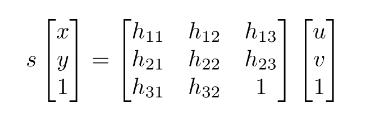

| Deliverable | Due Date              |
|---------------|----------------------------------------------------------------------------|
| Briefing   | Wednesday, March 24th at 1:00PM EST     |
| [Team Member Assessment](todo link here)  | Friday, March 26th at 11:59PM EST |

# Lab 4: Vision In Tesse

Welcome to Lab 4, where you will learn how to use the semantic segmentation camera in tesse to allow the racecar to park using a colored cone and follow lines!

The semantic segmentation camera provides images that classify every object in the image by displaying them with a different color according to the object label. (You can see the camera images when you run `rqt_image_view` after your tesse-ros-bridge node and executable are up and running.)

The images from the semantic segmentation camera look something like this:

We provide you with a csv file that maps these semantic class labels to the rgba colors in the image, and you will do a combination of image processing and control to complete the tasks in this lab.

In this lab, your team will do the following:
* Experiment with object detection algorithms
* Learn how to detect a road lane line in images
* Learn how to transform a pixel from an image to a real world plane (given node to do this step)
* Develop a parking controller to park your robot in front of an orange cone
* Extend your parking controller into a line following controller

### Lab Modules
This lab has a lot in it, so we are encouraging parallelization by breaking up the components of the lab into <TODO> distinct modules, which you will combine together. Each module tackles an interesting problem in computer vision/controls.  
- Module 1: Cone Detection via Color Segmentation
- Module 2: Parking in front of a cone in Tesse 
- Module 3: Line Detection via Hough Transforms

Here’s how they fit together. 

### Bringing it together:
The first module of this lab asks you to find an orange cone in images. Here you will learn/practice some computer vision algorithms that will help you locate the cone. Module 2 asks you to reuse your algorithms from module to find a cone in tesse simulation and a transformation to convert the pixel space location of the cone to 3D world space. You will then develop a controller to help you park the car in front of the cone. 

In module 3, you will be able to extend your image detection and parking controller from module 1 & 2, to follow a dashed line tesse. I hope you can visualize each module builds on top of the previous one.  

### Computer Setup
For this lab, you will need Opencv3. The virtual machines already have it, but it likely needs to be updated to 3.4 and are missing the opencv-contrib package (this is where some propietary algorithms were moved to in opencv3). If you are running linux natively, depending on what you've done before you may or may not have the correct setup. Try running these commands as well, and the correct packages will install as needed.

Steps:

`sudo apt-get install python-pip`

`pip install opencv-python==3.4.2.16`

`pip install opencv-contrib-python==3.4.2.16`

`pip install imutils`

You will also need tesse set up. Refer to instructions in [TESSE setup handout](https://github.com/mit-rss/tesse_install) if you need a reminder.

Lastly, download the most up to date executable for this lab [here](https://drive.google.com/drive/u/1/folders/18dQDeseaLYEjFnNGEQhOgWi1wMHtVmdu)

### Analysis:
We are also looking for a bit more in terms of experimental analysis in the lab than we have in the past. We are, in particular, looking for analysis of your vision algorithm and the controller.

Vision Analysis:
We wrote some code to test the Intersection over Union (IOU) scores of your vision algorithms on the datasets provided. IOU is a measure of how accurate bounding boxes are, and is a choice metric for analysis of object detection algorithms (including for neural networks!). Go into **computer_vision/**  and run:

`python cv_test.py cone`

To test your algorithm against the cone dataset. Results will be outputted to a .csv file in **scores/**. Some images will not yield good results. This is expected, and we would like to know why the algorithm works/doesn't work for certain images in your writeup.

Controller analysis: (TODO MODIFY)
When you wrote the parking controller (module <INSERT HERE>), you published error messages. Now it’s time to use **rqt_plot** to generate some plots. Try running the following experiments:
- Put a cone directly in front of the car, ~3-5 meters away. Your car should drive straight forward and stop in front of the cone. Show us plots of x-error and total-error over time, and be prepared to discuss.
- Run the car on one of our tracks, and check out the plots for any interesting error signals. Compare plots at different speeds, and see how error signals change with speed.
### Grading: /10 (TODO MODIFY)
Technical implementation
- 1 point for satisfactory completion of module 1
- 1 point for satisfactory completion of module 2
- 1 point for satisfactory completion of module 3
- 1 point for satisfactory completion of module 4
- 1 point for successful integration of the 4 components

Evaluation (include in presentation): (TODO MODIFY)
- 2 points for explaining vision algorithm strengths and weaknesses. Why does each algorithm perform as it does on each dataset?
- 1 point for explaining the homography transformation. How do we convert pixels to plane coordinates?
- 1 point for demonstrating and explaining performance of the parking controller. Make sure you mention your method for tuning the controller gains. Hint: include error plots from **rqt_plot**
- 1 point for demonstrating and explaining performance of the line-follower. Make sure you mention your method for tuning the controller gains. Hint: include error plots from **rqt_plot**

# Nodes

Lane Following Vision Node:
 - Subscribes: /tesse/segmentation: image message
 - Publishes: /lane_line_px: line message

Cone Parking Vision Node:
 - Subscribes: /tesse/segmentation: image message
 - Publishes: /relative_cone_px: pose message (pixel coordinates)

Homography Node:
 - Subscribes: /relative_cone_px: pose message
 - Subscribes: /lane_line_px: line message
 - Publishes: /relative_cone: pose message

Control Node:
- Subscribes: /relative_cone: pose message

# Module 1: Cone Detection Via Color Segmentation
In lecture we learned lots of different ways to detect objects. Sometimes it pays to train a fancy neural net to do the job. Sometimes we are willing to wait and let SIFT find it. Template matching is cool too.

But sometimes simple algorithms are the correct choice, and for our purposes, identifying the cone by its distinctive color will prove most effective. Your job in this module will be identify cones (and other orange objects) and output bounding boxes containing them.

Take a peek at **cone_detection/color_segmentation.py**. Here you will find your starter code, though there is very little of it. There is a considerable degree of freedom in implementing your segmentation algorithm, and we will try to guide you at a high level. When it comes to opencv functions and examples, Googling will not disappoint. Keywords like “python” and “opencv3” will help you avoid c++ and older opencv versions of functions.

The cool thing about this module is that you can build up your algorithm incrementally. Display the original image. Modify, convert, filter, etc. and see what it looks like. Try a different opencv function. See what that does to the already changed image.

Here are some helpful hints:
- As we’ve seen in lecture, there are different color spaces. You are probably used to RGB/BGR, but you’ll find the HUE in HSV to vary less with lighting. Try cvtColor. Speaking of, the images here are BGR, not RBG.
- Use cv2.inRange to apply a mask over your image, keeping just what you want.
- Erosion and dilation are a great way to remove outliers and give your cone a bit more of a defined shape.
- OpenCV contour functions can prove very helpful. cv2.findContours + cv2.boundingRect are a powerful combination. Just saying.

Don’t forget conventions! Image indexing works like this (in this lab):

### Evaluation:
We are using the Intersection Over Union metric for evaluating bounding box success. Run **python cv_test.py cone color** to test your algorithm against our dataset. We print out the IOU values for you. We expect some sort of analysis involving this metric in your presentation.
By the way- you won’t get them all (probably). But 100% accuracy is not necessary for a great parking controller.

# Module 2: Parking in front of Cone in Tesse
  Segmentation      | Cone in mask
--------------------|---------------------------
 | 

In this section, you will detect a cone using the segmentation camera of the tesse simulator. You will then drive your car(tesse car) towards the cone, and finally park the car in front of the cone. This task takes three steps to complete:

**step 1**: Using the algorithms(e.g. color segmentation) you have practiced in the first module of this lab and the segmentation camera of the tesse car, you need to find the location of the cone in the view of the camera. We provided a skeleton code that subscribes to the proper messages for you, `src/cone_detector.py`. Your task is to find the center of the cone and publish that to the topic "/relative_cone" using the geometry message [Point](http://docs.ros.org/en/jade/api/geometry_msgs/html/msg/Point.html).

To simplify things for you, we provided launch file(launch/cone_parking.launch(MAKE THIS)) within tesse_ros_bridge which drops the car near the cone at a reasonable angle and distance. We also provided the segmentation label, RGB color, of the cone which is defined at the top `src/cone_detector.py` class as `SEG_LABEL`.

**step 2**: Use the homography matrix to transform the point you have published in **step 1** from image coordinate to world coordinate. We have implemented the homography matrix calculation for you, so all you need to do is to use the provided function to do the transformation. This homography node should subscribe to your point in image coordinates and publish a point in world (meters) coordinates. To understand the homography matrix and how you can compute it, we provided a section of the previous year's lab4 which explains where the homography matrix is coming from.

**Step 3**: Implement a controller that drives the car towards the cone until you're desired distance away and at a desired angle. Open up `scripts/parking_controller.py`, We’ve subscribed to the “/relative_cone” topic for you, and have set up the publisher/callback as well. Your job is to take the cone location message from **step 2**, and write a control policy that parks in front of the cone. Publish desired steering angles and velocity just like in lab2.

We aren’t aiming to give you a specific algorithm to run your controller, and we encourage you to play around. Try answering these questions:
- What should the robot do if the cone is far in front?
- What should the robot do if it is too close?
- What if the robot isn’t too close or far, but the cone isn’t directly in front of the robot?
- How can we keep the cone in frame when we are using our real camera?

# Line Follower
After you and your team put your modules together to park in front of a cone, a modification of your code will create a controller for a line follower. Like a donkey chasing a carrot, if you restrict the view of your robot to what is a little ahead of it you will follow a colored line.

This works by setting a lookahead distance. See an example [here](https://gfycat.com/SeveralQueasyAmberpenshell).

We're going to be doing a realistic line follower on the road in simulation! You are going to be following the center line of the road.

Here is the view from the semantic segmentation, and as you can see the lane markers are dark blue here:

Sometimes the lanes are double lines and sometimes they are dashed, so first we're going to write a node that extracts a single approximated line from our images in slope-intercept form (y = mx + b).

First you'll want to find the semantic label and color that identify the lane marker. The semantic label associated with our lane marker is in `params_tesse.yaml`. You can then extract the rgba value associated with that semantic label from `tesse_windridge_city_scene_segmentation_mapping.csv`.

Then you'll want to apply a mask over your image just like in cone detection to keep just the lane markers. What else can you mask out? (hint: There probably won't be any lanes in the sky.) Dilation is a good way to exagerate the road lines (relevant for the dashed ones) so they don't dissapear in the next line finding step!

The meat and potatoes of this module is the [Hough Line Transform](https://opencv-python-tutroals.readthedocs.io/en/latest/py_tutorials/py_imgproc/py_houghlines/py_houghlines.html). This will allow you to detect broken and imperfect lines in the image. In practice you will end up with many hough lines like so:

, so you will need to average them to be one single line.
The averaged line should be like the red line below:

Once you have the m and b of this averaged line, publish your line parameters to the `lane_line_topic` specified in `params_tesse.yaml` using the provided `LaneLine.msg` type.

We have provided you a node that uses the homography transformation to convert pixels to plane coordinates, and therefore enable you to project a point on your line in from the image plane to the ground with respect to your robot!

Now you're ready to choose a lookahead distance on your line and use your parking controller to follow it.

## Homography Transformation
This section is just you give you a quck overview of what the homography matrix is and how to compute it. **Note**, there are no deliverable in this section. If you're curios, please keep reading.

In this section you will use the camera to determine the position of a cone relative to the racecar. This module of the lab involves working on the car.
### Launching the ZED Camera
- On the car, use `roslaunch zed_wrapper zed.launch` to launch ZED
- See lab 1 for instructions on how to export ROS_MASTER, then run `rqt_image_view` from your host computer
The ZED publishes to a number of topics topics which you can learn about [here](https://docs.stereolabs.com/integrations/ros/getting-started/#displaying-zed-data). To view them, select the topic name through the dropdown menu. Do not use the depth image for this lab. The one you probably want to use is the default rectified camera: `/zed/rgb/image_rect_color`. If your ZED camera is not working, try running this script `~/zed/compiled_samples/ZED_Camera_Control`.

### Accessing Image Data (TODO MODIFY)
Write a ros subscriber for ZED camera topic.
The ZED camera publishes message of type [Image](http://docs.ros.org/api/sensor_msgs/html/msg/Image.html) from sensor_msgs.
Learn about this message with the rosmsg command, `rosmsg show sensor_msgs/Image`.
The image data is in ROS message data-structure which is not directly recognized by OpenCV, you might have also learned that OpenCV image representations are sometimes unique and bizarre(e.g. BGR instead of RGB). To convert between CV image data structures(mat) to ROS image representations(ROS Message structures) you may find [CV bridge](http://wiki.ros.org/cv_bridge/Tutorials/ConvertingBetweenROSImagesAndOpenCVImagesPython) helpful.
**NOTE: The velodyne cameras are upside down (fix with imutils.rotate() or similar)**

### Converting pixel coordinates to x-y coordinates (TODO MODIFY)
If you recall from lecture, a camera is a sensor that converts 3D points (x,y,z) into 2D pixels (u,v). If we put on our linear algebra hats, we can take a peek at the projection of a 3D point to a 2D point:

In robotics, we are generally concerned with the inverse problem. Given a 2D (image) point, how can we extract a 3D (world) point?
We need some tools and tricks to make that sort of calculation, as we lost (depth) information projecting down to our 2D pixel. Stereo cameras, for example, coordinate points seen from two cameras to add information and retrieve the X-Y-Z coordinates.
In this lab, we will use another interesting fact about linear transformations for back out X-Y positions of pixels.

### Coordinate space conversion
The racecar can’t roll over or fly (no matter how cool it might look), so the ZED camera will always have a fixed placement with respect to the ground plane. By determining exactly what that placement is, we can compute a function that takes in image pixel coordinates (u, v) and returns the coordinates of the point on the floor (x, y) relative to the car that projects onto the pixel (u, v).

This “function” is called a homography. Even though we can’t back out arbitrary 3D points from 2D pixels without lots of extra work, we can back out 2D world points if those points lie on a plane (and can therefore be thought of as 2D) that is fixed with respect to our camera.

Check out this illustration of a camera and world plane. There exists a linear transformation between the camera projection and the world plane, since the world plane has two dimensions like an image plane.

### Find the Homography Matrix
To find the homography matrix, you should first determine the pixel coordinates of several real world points. You should then measure the physical coordinates of these points on the 2D ground plane. If you gather enough of these point correspondences (at least 4), you have enough information to compute a homography matrix:

#### Notes for finding the homography matrix:
- The opencv findhomography implementation expects 3X1 data points in homogenous coordinates [X,Y,1].
- You may need to rescale the homography output X',Y',Z' such that Z' = 1.

Many existing packages including [OpenCV](https://docs.opencv.org/2.4/modules/calib3d/doc/camera_calibration_and_3d_reconstruction.html#findhomography) can be used to compute homography matrices.

`rqt_image_view` will be a useful debugging tool here. If you enable mouse clicking (there is a checkbox next to the topic name), then `rqt_image_view` will publish the pixel coordinates of points you click on in the image to a topic like this: `/zed/rgb/image_rect_color_mouse_left`. Publish a marker to RVIZ using this pixel, and you should be able to quickly tell if your homography matrix is doing its job.

### General Tips/FAQ:
